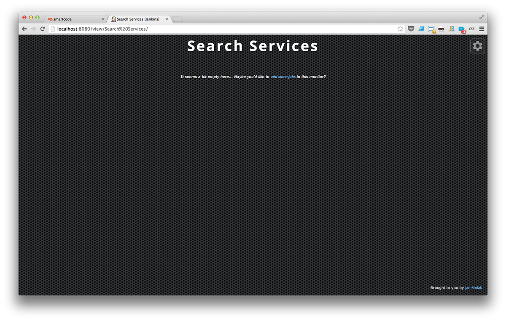
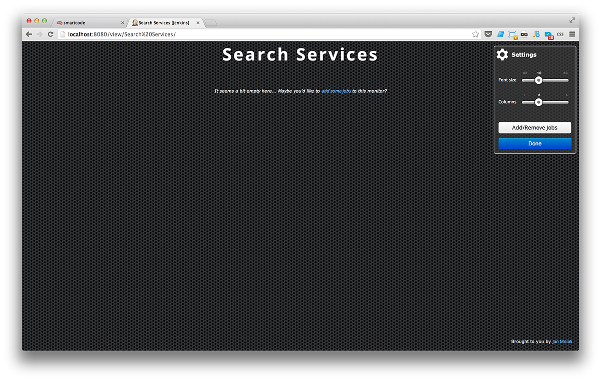
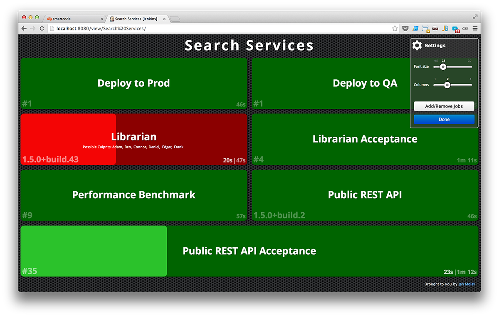
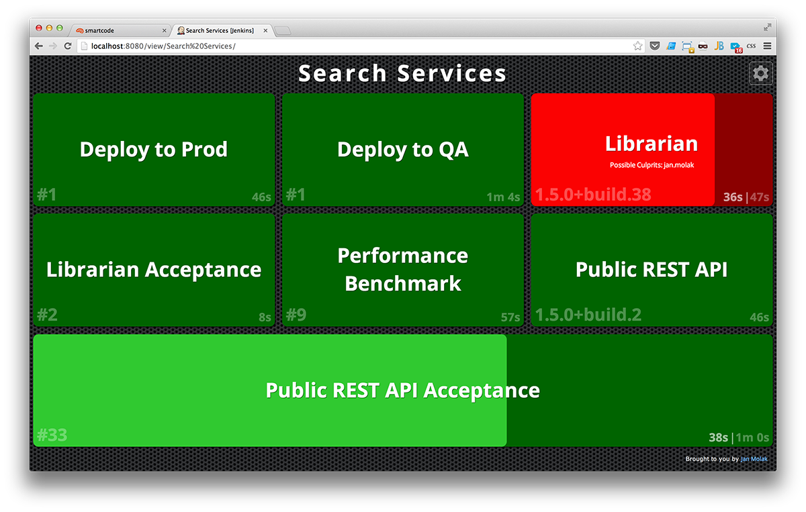
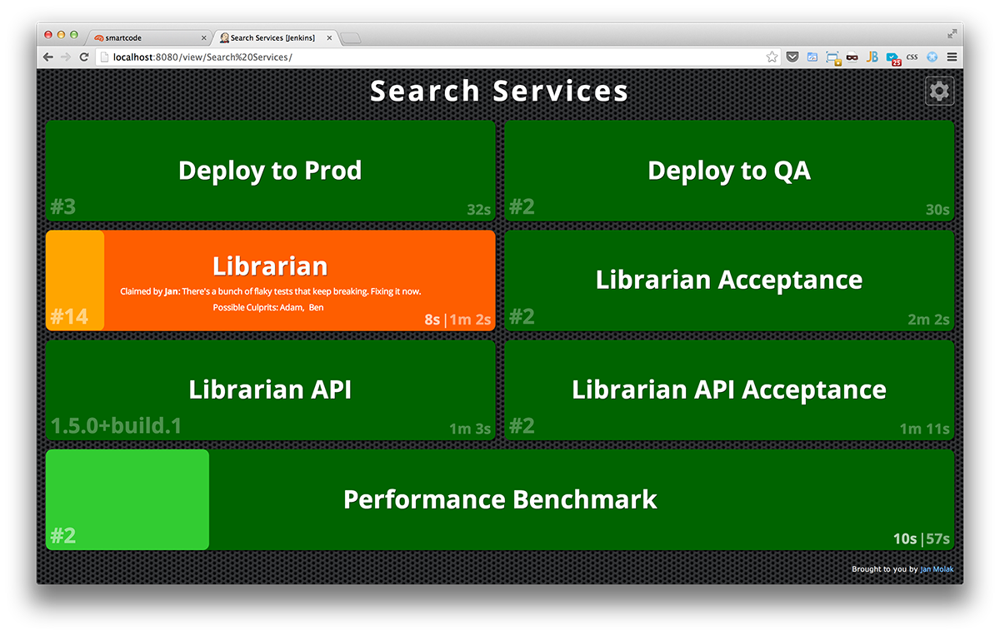

# Jenkins CI Build Monitor Plugin

Build Monitor Plugin provides a highly visible view of the status of selected Jenkins jobs.

It easily accommodates different computer screen sizes and is ideal as an Extreme Feedback Device to be displayed on a screen on your office wall.
(Inspired by the no longer maintained RadiatorView plugin).

Have a question? Perhaps it's already been answered - check the [FAQ](#faq) section below.

## Setting up

To create a new Build Monitor View, click on the "New View" tab, select "Build Monitor View" and select jobs you wish
to display on the monitor. You can have as many Build Monitor Views as you want - the most popular approach is to have one per team or one per project.

## Features

I'd like to keep the plugin as simple as possible and avoid cluttering the view with statistics I don't find of high value in the context of a Build Monitor.

Current functionality includes:

1. Displaying the status and progress of selected jobs
1. Displaying names of people who might be responsible for "breaking the build"
1. Easily customisable number of columns and size of the font used, making it easier to accommodate screens of different sizes
1. UI configuration is stored in a cookie, making it possible to display different number of columns and using different font size on each screen at your office

All the features I'm hoping to add in the near future are listed in the "Roadmap" section of this README

# A picture is worth a thousand words

## TDD

If you'd like to understand more about the logic behind the Build Monitor Plugin, 
feel free to have a look at the [tests that drove the design](/src/test/java/com/smartcodeltd/jenkinsci/plugins/buildmonitor/viewmodel/JobViewTest.java).

## Known Limitations

### Browser support - Modern web browsers only

To avoid unnecessary complexity when implementing the view layer I decided to use CSS 3 flexbox.
The standard is currently supported by [most modern web browsers](http://caniuse.com/flexbox),
so if your browser doesn't support this feature - [consider upgrading](http://browsehappy.com/) :)

## Roadmap

1. Display what triggered the build (SCM change, another job, manual)
1. Display how long a given job has been failing for
1. ~~Support for [Claim Plugin](https://wiki.jenkins-ci.org/display/JENKINS/Claim+plugin)~~
1. Support for [Gravatar](http://gravatar.com)
1. Display parameters of parametrized jobs
1. ~~Persist layout configuration changes in a long-lived cookie.~~

## FAQ

### How do I let my teammates know that I'm fixing a broken build?

By claiming it. Build Monitor supports Jenkins [Claim Plugin](https://wiki.jenkins-ci.org/display/JENKINS/Claim+plugin), so once you have it installed, enable "Broken build claiming" in the "Post-build actions" of your Jenkins job. From now on you'll be able to claim any further broken builds and Build Monitor will pick it up.

You might also be interested in a [script](https://wiki.jenkins-ci.org/display/JENKINS/Allow+broken+build+claiming+on+every+jobs) that enables claiming on all your Jenkins jobs.

### How do I know what broke the build?

Wouldn't it be great to know _what_ made your build fail? Well of course it would. Build Monitor supports Jenkins [Buld Failure Analyzer Plugin](https://wiki.jenkins-ci.org/display/JENKINS/Build+Failure+Analyzer) so get it, [teach it](https://wiki.jenkins-ci.org/display/JENKINS/Build+Failure+Analyzer#BuildFailureAnalyzer-Knowledgebase) and Build Monitor will tell you what the Failure Analyzer found out.

### I have too many jobs on one screen, what should I do?

You have several options here:

1. **review the granularity of your jobs**: If you have too many low-level jobs displayed on one screen, consider consolidating them using [Promoted Builds Plugin](https://wiki.jenkins-ci.org/display/JENKINS/Promoted+Builds+Plugin) or [MultiJob Plugin](https://wiki.jenkins-ci.org/display/JENKINS/Multijob+Plugin)
1. **use job filters**: Build Monitor supports Jenkins [View Job Filters Plugin](https://wiki.jenkins-ci.org/display/JENKINS/View+Job+Filters), if you have it installed
1. get a bigger screen ...

### Red and green colours are lovely, but I'm colour blind ...
There's a colour blind mode you can [enable in the Settings](https://github.com/jan-molak/jenkins-build-monitor-plugin/issues/30#issuecomment-35849019)

## License: MIT

## Open Source Software Used

* [Angular.js](http://angularjs.org/)
* [Angular-slider](http://prajwalkman.github.io/angular-slider/)
* Customised [Angular Bootstrap](http://angular-ui.github.io/bootstrap/)
* [HTML5 Boilerplate](http://html5boilerplate.com/) normalize.css
* [OpenSans font](http://www.google.com/fonts/specimen/Open+Sans) by Steve Matteson

## Inspired by

No longer maintained [Radiator View Plugin](https://wiki.jenkins-ci.org/display/JENKINS/Radiator+View+Plugin)
